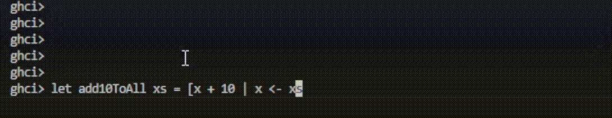
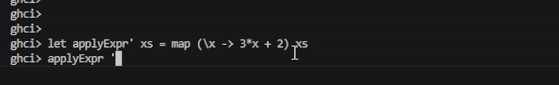
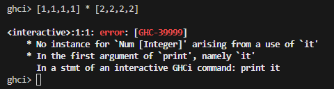
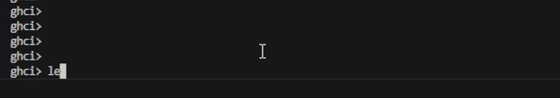
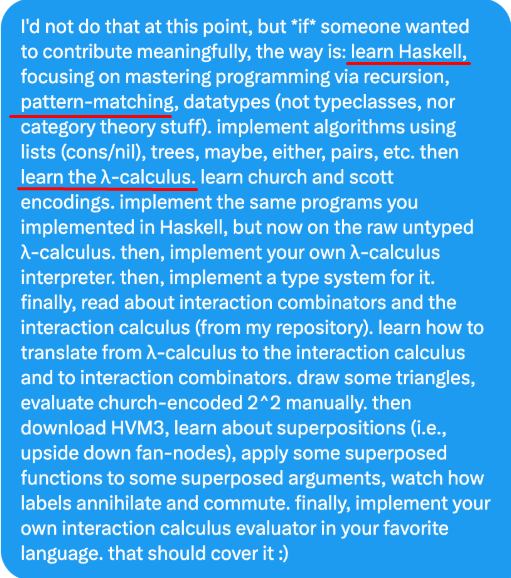

# List Comprehensions
---


List comprehension é uma forma concisa de gerar listas, inspirada na notação matemática de conjuntos: permite criar novas listas a partir de listas existentes, aplicando transformações e filtros em uma única expressão.


`[ expressão | variável <- lista, condição1, condição2, ... ]`

Exemplo:

`[x*2 | x <- [1..10], even x]`


## Parte Teórica


É uma forma muito mais elegante de criar listas a partir de outras listas. Pensei nela como uma "fábrica de listas". Em vez de criar uma lista vazia e usar laços de repetição (`for`, `while`) e condicionais (`if`) para adicionar elementos um por um, a gente descreve as "regras de produção" dessa nova lista em uma única linha.


### A Estrutura em Haskell


```haskell
ghci> [x * 2 | x <- [1..10], even x]
[4,8,12,16,20]
```

### List Comprehensions em Outras Linguagens

Não é exclusivo do Haskell, várias outras linguagens implementam a mesma ideia (leva a entender que é um recurso bem utilizado).

#### **Python**

A ordem é um pouco diferente mas a ideia é a mesma.

```python
# x*2 de 1..10 pares
S = [x * 2 for x in range(1, 11) if x % 2 == 0]
# [4, 8, 12, 16, 20]
```

mas cuidado.. python não tem lazy evaluation

```python
# trava o programa ou estoura memória
[x for x in range(10**18)]  
```

#### **JavaScript**

Js não tem list comprehension nativa como, mas o mesmo resultado é alcançado de forma  usando métodos de `Array` como `.map()` e `.filter()`.

```javascript
const numeros = [1, 2, 3, 4, 5, 6, 7, 8, 9, 10];
const resultado = numeros.filter(x => x % 2 === 0).map(x => x * 2);
// Saída: [4, 8, 12, 16, 20]
```

também é eager, não usar listas infinitas.

*Eager evaluation*: avaliação imediata de expressões, ou seja, os valores são calculados assim que são definidos, sem esperar para serem usados.

#### **Julia**

Aqui é chamado de array comprehension e é muito parecido com python.

```Julia
S = [x*2 for x in 1:10 if x % 2 == 0]
#saída [4, 8, 12, 16, 20]
```

### 1. Exercício Fácil (1)

Defina uma função `add10ToAll :: [Int] -> [Int]`, que receba uma lista e adicione o valor 10 a cada elemento dessa lista, produzindo outra lista. Use list comprehension.
barbada

**Meu código:**
```haskell
add10ToAll :: [Int] -> [Int]
add10ToAll xs = [x + 10 | x <- xs]
```

**Execução:**


---

### 2. Exercício Médio (5)
4 - Usando *list comprehension*, defina uma função `applyExpr :: [Int] -> [Int]`, que receba uma lista e calcule `3*x+2` para cada elemento `x` da lista, produzindo outra lista.

A função `applyExpr` ficou
```haskell
[3*x + 2 | x <- xs]
```

5 - Reescreva a função do exercício anterior usando lambda e uma função de alta ordem. O novo nome da função será `applyExpr' :: [Int] -> [Int]`.

**Resolução:**


Errei uma vez tentando aplicar `map 3*x + 2 xs`. Esqueci que precisa da função como argumento e nao tinha lido direito o enunciado


```haskell
applyExpr' :: [Int] -> [Int]
applyExpr' xs = map (\x -> 3*x + 2) xs
```

**Execução:**


---

### 3. Exercício Difícil (15)

Em Haskell, a função `zip` combina elementos de duas listas, produzindo uma lista de tuplas. Por exemplo:

    
    > zip [1,2] "ab"
    [(1,'a'),(2,'b')]
    > zip [1..] "abcde"
    [(1,'a'),(2,'b'),(3,'c'),(4,'d'),(5,'e')]
    

Usando a função `zip` com *list comprehension* e outras funções auxiliares, escreva uma função `dotProd :: [Int] -> [Int] -> Int` que calcule o somatório dos produtos dos pares de elementos de duas listas, conforme o exemplo:
```haskell
 dotProd [1,1,1,1] [2,2,2,2] -- 1*2 + 1*2 + 1*2 + 1*2
8
```

**resolução:**

só pra confirmar eu tentei `xs * ys` mas não vai né


testei também `[a*b | a <- xs, b <- ys]` mas isso gera o produto de todas as combinações, pra cada elemento de xs ele percorre todos os elementos de ys.


aí eu fiz com o zip que o enunciado falou

 `(a,b) <- zip xs ys`

```haskell
dotProd :: [Int] -> [Int] -> Int
dotProd xs ys = sum [a * b | (a, b) <- zip xs ys]
```

**Execução:**


---

## Extra: haskell em programação paralela

Brasileiro Victor Taelin, criador da HVM (Higher-Order Virtual Machine), uma máquina virtual de computação que promete rodar programas funcionais, como os escritos em Haskell, de forma massivamente paralela, aproveitando ao máximo o poder das CPUs e GPUs modernas.

A maioria dos computadores segue a arquitetura de von Neumann, máquina de Turing sendo o modelo teórico. A HVM contrasta com o paradigma sequencial/von Neumann ao usar Interaction Nets para paralelismo massivo.

Em seu X (antigo twitter) ele fala sobre "como contribuir para Higher Order Company":



### tweet original:
 https://x.com/VictorTaelin/status/1963258873235525655/photo/1


###  Palestra:
 HVM: um Runtime Paralelo, por Victor Taelin. Palestra na Gambiconf, Universidade de São Paulo (USP).

[](https://www.youtube.com/watch?v=sDPuQ-UjhVQ)


## Fontes 


http://learnyouahaskell.com/starting-out#im-a-list-comprehension
https://en.wikipedia.org/wiki/List_comprehension
https://docs.python.org/3/tutorial/datastructures.html#list-comprehensions
https://www.youtube.com/watch?v=dYKQSWtJv-w&ab_channel=EthanMyles