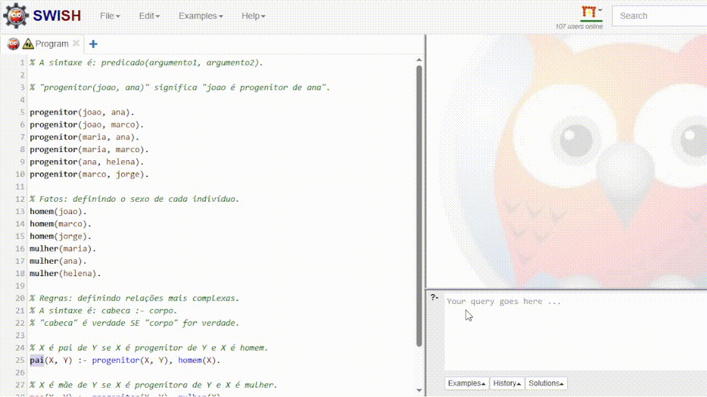

# Linguagem Prolog

O nome Prolog é uma abreviação de "Programming in Logic" e é basicamente a essência da linguagem, que é baseada nos princípios da lógica de predicados de primeira ordem (forma de representar frases e argumentos usando expressões matemáticas).

O objetivo inicial era desenvolver uma linguagem para o processamento de linguagem natural (humana).

Diferente de linguagens imperativas (C, Python) onde damos o passo a passo pra resolver o problema, em Prolog basta descrever o que sabemos sobre o problema (fatos e regras) e o que queremos saber (consultas/queries). A linguagem deduz a resposta.

### Áreas:

A melhor área parece ser a educação, mas também tem:

- IA: NLP, DeepLearning, LLM...
- Linguística Computacional (um dos motivos da criação)
- Bancos de Dados Relacional: pra consultas complexas e inferencia parece bom, mas acho que tem coisa melhor (PL/SQL, neo4j)
- Provar teoremas matemáticos: realizando inferências lógicas, área clássica do Prolog.


## Sintaxe 

É bem diferente da maioria, os elementos principais são: fatos, regras, predicado e consultas.

Fatos: declarações imutáveis.

Regras: declarações que definem relações condicionais. Elas  permitem inferir novos fatos a partir dos existentes.

Predicado: declaração lógica que descreve uma relação entre fatos ou regras, sendo utilizado para fazer consultas e inferências sobre dados.

Consultas: perguntas que fazemos ao sistema Prolog com base nos fatos e regras que fornecemos.

Também me chamou atenção o "átomo" que eu achei que era uma string, na verdade é uma constante simbólica (enum em Python). Começa com letra minúscula ou aspas simples (').

Variáveis são declaradas com letra maiúscula ou underscore ( _ ).

## Exemplo Clássico: Árvore Genealógica


```Prolog
% A sintaxe é: predicado(argumento1, argumento2).

% "progenitor(joao, ana)" significa "joao é progenitor de ana".

progenitor(joao, ana).
progenitor(joao, marco).
progenitor(maria, ana).
progenitor(maria, marco).
progenitor(ana, helena).
progenitor(marco, jorge).

% Fatos: definindo o sexo de cada indivíduo.
homem(joao).
homem(marco).
homem(jorge).
mulher(maria).
mulher(ana).
mulher(helena).

% Regras: definindo relações mais complexas.
% A sintaxe é: cabeca :- corpo.
% "cabeca" é verdade SE "corpo" for verdade.

% X é pai de Y se X é progenitor de Y e X é homem.
pai(X, Y) :- progenitor(X, Y), homem(X).

% X é mãe de Y se X é progenitora de Y e X é mulher.
mae(X, Y) :- progenitor(X, Y), mulher(X).

% X é avô de Z se X é pai de Y e Y é progenitor de Z.
avo(X, Z) :- pai(X, Y), progenitor(Y, Z).
```


Realizando Consultas

Quem é o pai de ana?

```Prolog
?- pai(X, ana).
```

Maria é mãe de quem?

```Prolog
?- mae(maria, Y).
```

João é avô de quem?


```Prolog
?- avo(joao, Z).
```



## Comparações
Apesar das grandes diferenças de Python, tem alguns paralelos:

Tipagem Dinâmica:  as variáveis em Prolog não têm um tipo definido estaticamente. Uma variável pode representar um número, um átomo (similar a uma string) ou uma estrutura de dados complexa, dependendo do contexto.

A diferença fundamental é o Paradigma Declarativo vs. Imperativo/Orientado a Objetos: Em Python, você escreve uma sequência de comandos (laços, condicionais, chamadas de função) para atingir um objetivo. Em Prolog, define um conjunto de conhecimentos e deixa o motor de inferência interno que é baseado em mecanismos como a `unificação` (tornar duas expressões logicamente iguais, encontrando valores para variáveis que as tornam idênticas.) e o `backtracking` (explorar alternativas para variáveis quando uma tentativa de unificação falha, voltando e tentando outros caminhos possíveis.) encontrar as soluções.

Ausência de Estruturas de Controle Tradicionais: Em Prolog, não existem comandos como for, while ou if-then-else no sentido tradicional. A repetição é alcançada através da recursão e o fluxo de controle é gerenciado pelo mecanismo de backtracking (a capacidade de voltar atrás e tentar um caminho diferente para satisfazer uma consulta).

O Conceito de "Sucesso" e "Falha": Uma "função" em Prolog (chamada de predicado) não "retorna" um valor no sentido tradicional. Em vez disso, ela "sucede" (encontra uma solução que torna a consulta verdadeira) ou "falha".

## Dúvidas e etc

"Pensar em Lógica": A maior dificuldade é, sem dúvida, aprender a modelar um problema em termos de fatos e regras 
lógicas, em vez de uma sequência de instruções.

Ainda é utilizado hoje em dia?

R: muito pouco

A parte boa:

**R/prolog [deleted_user]**

"Eu penso que aprender isso (Prolog) traz benefícios além do que é imediatamente aplicável: mostra que tipos de coisas malucas são possíveis, ajuda a reduzir o hype em torno de coisas novas e ajuda a analisar problemas de forma mais *independente da tecnologia*. Mas esses são benefícios intangíveis - estão na forma de pensar.

No original ele usa o termo "technology-agnostically", ou seja, resolver problema não dependendo de lib ou framework - se tornar verdadeiramente um "poliglota".

**R/prolog [Zwarakatranemia]**

"Prolog maybe not that much, but logic programming concepts are being used.

For example the use of Horn clauses in DeepMind:

https://deepmind.google/discover/blog/alphageometry-an-olympiad-level-ai-system-for-geometry/"

Artigo mostrando uso de Prolog pra melhorar reasoning de LLM:

[Use Prolog to improve LLM's reasoning](https://shchegrikovich.substack.com/p/use-prolog-to-improve-llms-reasoning)

Alguma galera de finanças também parece usar:

**R/prolog [toblotron]**

"My former company uses it to handle complex business-rules in fintech [...]"
 
Onde prolog parece BRILHAR MESMO é em "neurosymbolic": é IA que combina aprendizado estatístico (neural) com lógica e conhecimento explícito (simbólico).

["The Revival of Prolog and Neuro-Symbolic AI"](https://medium.com/@kenichisasagawa/the-revival-of-prolog-and-neuro-symbolic-ai-1b2e66b1b7b0)


## Referências

https://pt.wikipedia.org/wiki/Prolog

https://www.reddit.com/r/prolog

https://www.swi-prolog.org/

